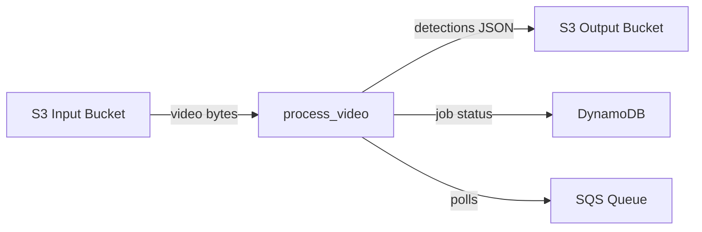

# Codebase Overview

> Distributed batch inference pipeline that processes video files through YOLOv8 object detection and produces per-frame JSON results, designed to run on swappable compute backends (EC2, Fargate, Lambda).

**Last updated:** 2026-07-10  
**Primary language:** Python 3.11+  
**Architecture style:** Worker module within a planned monorepo (worker/ + dashboard/ + terraform/ + docs/)

---

## Architecture overview

The system is a video inference pipeline with a single core function — `process_video()` — that reads video from storage, runs YOLOv8 detection on sampled frames, and writes JSON results back to storage. This function is compute-agnostic: it will be invoked by different wrappers depending on the deployment target (SQS poller on EC2, ECS task on Fargate, or Lambda handler).

Currently only the worker module exists (Phase 1 complete). The full system will add a React dashboard (Phase 3), Terraform-managed AWS infrastructure (Phase 2), and three compute invokers (Phases 4-6).



State is stored externally: video files in S3, results as JSON in S3, job metadata in DynamoDB. The worker itself is stateless — all state flows through the storage adapter and schemas.

---

## Tech stack

| Layer | Technology | Notes |
|---|---|---|
| Runtime | Python 3.11+ | Requires `>=3.11` per pyproject.toml; uses 3.13 locally |
| Data validation | Pydantic v2 | `field_validator` decorators; `model_dump(mode="json")` for serialization |
| ML inference | ultralytics (YOLOv8) | CPU-only (free tier); `yolov8n.pt` default weights |
| Video processing | OpenCV (cv2) | Decodes video via temp file on Windows (cannot read raw bytes) |
| Numerical | NumPy | Frames are `(H, W, 3)` uint8 arrays |
| Build | Hatchling | PEP 517 build backend |
| Testing | pytest + pytest-mock | 78 locked tests across 4 files; `addopts = "-v --tb=short"` |
| Test coverage | pytest-cov | Installed but not yet configured with thresholds |
| Cloud SDK | boto3 | S3 operations (not yet wired — storage adapter uses local fallback) |

---

## Key modules

| Path | Responsibility |
|---|---|
| `worker/src/schemas.py` | Pydantic models: `Detection`, `JobInput`, `JobResult`. Source of truth for all data contracts. Bbox uses YOLO format `[x_center, y_center, width, height]` normalized 0-1. |
| `worker/src/detector.py` | YOLOv8 wrapper. `load_model()` returns a model object; `predict()` accepts a numpy frame and returns `List[Detection]`. Uses a global singleton `_model` pattern. |
| `worker/src/processor.py` | `process_video()` orchestrator. Reads video bytes → decodes frames via OpenCV → runs detection per frame → writes JSON results. Handles all error paths and returns `JobResult`. |
| `worker/src/storage.py` | `StorageAdapter` class with `read_video()` and `write_json()`. Local file mode (default); S3 mode stubbed with `NotImplementedError`. Module-level functions wrap a global adapter instance. |
| `tests/unit/` | 4 test files, 78 tests total. All marked as LOCKED — do not modify. Cover schemas, detector, storage, and processor. |
| `.agent-tasks/` | Orchestrator-driven planning artifacts: phased plan, agent team roster, per-agent task lists, project status. |

> ⚠️ `worker/src/processor.py` — The `process_video()` function is the central integration point. Changes here affect all compute backends (EC2, Fargate, Lambda). Test with the full unit suite before merging.

---

## Non-obvious patterns

**Locked tests as executable specification**  
All unit test files in `tests/unit/` are marked LOCKED and must never be modified by implementation agents. Tests were written first (TDD Red phase) and define the exact contract for each module. If a test fails after your change, the implementation is wrong — not the test.

**OpenCV requires temp file for video decoding on Windows**  
`processor.py` writes video bytes to a `NamedTemporaryFile` before passing the path to `cv2.VideoCapture`. OpenCV on Windows cannot read raw bytes directly via `VideoCapture` — it needs a file path. The temp file is cleaned up in a `finally` block.

**Global model singleton in detector.py**  
`detector.py` uses a module-level `_model` variable. `load_model()` sets it; `predict()` calls it lazily if not yet loaded. This avoids re-loading the model on every frame but means the model persists for the process lifetime. In production, each compute invocation (Lambda, Fargate task) gets a fresh process, so this is safe.

**Storage adapter is swappable but not yet wired to S3**  
`StorageAdapter` accepts `use_s3=True` but both S3 methods raise `NotImplementedError`. Local file mode uses `data/` as the base path. The module exposes `read_video()` and `write_json()` as free functions wrapping a global adapter instance — this is the interface `processor.py` calls.

**Detection bbox format: YOLO, not COCO**  
Bounding boxes are `[x_center, y_center, width, height]` normalized to 0-1. This is the standard YOLO output format, not the COCO `[x, y, width, height]` absolute format. The `Detection` model validates each component is in `(0, 1]` range.

**JobResult.status is a Literal type**  
Only `"completed"` or `"failed"` are valid — there is no `"running"` or `"pending"` status. The processor sets status synchronously before returning.

**Error results are written to storage**  
When `process_video()` fails, it attempts to write a `results/{job_id}_error.json` file before returning a failed `JobResult`. If the error write also fails, it is silently swallowed — the caller still gets the failed result.

---

## Development workflow

```bash
# 1. Create virtual environment and install dependencies
python -m venv .venv
source .venv/bin/activate  # or: .venv\Scripts\activate on Windows
pip install -e ".[dev]"

# 2. Run the full test suite (78 tests, all should pass)
pytest

# 3. Run tests with coverage
pytest --cov=worker --cov-report=term-missing

# 4. Run a specific test file
pytest tests/unit/test_schemas.py -v

# 5. Run a specific test class or function
pytest tests/unit/test_detector.py::TestLoadModel -v
pytest tests/unit/test_processor.py::TestProcessVideoHappyPath::test_returns_jobresult -v
```

**Test markers** (defined in pyproject.toml but not yet applied to tests):
- `unit` — fast, no external dependencies (current tests)
- `integration` — require real AWS resources
- `e2e` — full pipeline

**Environment setup**: Copy `.env.example` to `.env` (once it exists). Currently no environment variables are required for local development — the storage adapter defaults to local file mode.

---

## Architecture decisions

**Single `process_video()` function as the compute-agnostic core**  
The entire inference pipeline is a single function that takes a `JobInput` and returns a `JobResult`. Compute invokers (EC2 poller, Fargate task, Lambda handler) are thin wrappers that parse events, call this function, and handle side effects (SQS delete, DynamoDB update). This makes swapping compute backends a matter of writing a new invoker — not changing pipeline logic.

**TDD with locked tests before implementation**  
The tester agent writes all unit tests for a phase first, confirms they fail (Red), then implementation agents write code to make them pass (Green). Tests are never modified by implementation agents. This is enforced by the orchestrator.

**Versioned compute progression: EC2 → Fargate → Lambda**  
The same `process_video()` function runs on all three compute backends. Each version teaches a different AWS deployment model. The worker code does not change between versions — only the invoker and infrastructure change.

**Pydantic models as the data contract**  
`Detection`, `JobInput`, and `JobResult` are the single source of truth for all data flowing through the system. The processor builds results using `JobResult.model_dump(mode="json")` to ensure consistent field names and ISO timestamps. The detections field is overridden post-dump to use the `(frame_index, detections[])` tuple format.

**JSON-only output (no annotated video)**  
Results are stored as structured JSON, not rendered video with bounding box overlays. This avoids an FFmpeg dependency and keeps the pipeline lightweight for free-tier constraints.

---

## Before you change code

- The 4 test files in `tests/unit/` are LOCKED. Never modify them. If your change breaks a test, fix the implementation.
- `processor.py` uses `cv2.VideoCapture` with a temp file path — not raw bytes. If you change how video is read, verify on Windows where OpenCV file-path behavior differs from Linux.
- `detector.py` uses a global `_model` singleton. In multi-threaded contexts this could cause race conditions. Current compute models are single-threaded per invocation, but watch this if concurrency is added.
- `storage.py` S3 methods raise `NotImplementedError`. When implementing S3 support, keep the local file fallback working — tests depend on it.
- `JobResult.detections` is `list[tuple[int, list[Detection]]]` — a list of `(frame_index, detections)` tuples, not a flat list. The processor manually constructs this format after `model_dump()`.
- The `data/` directory is the local storage root. It is created automatically by `StorageAdapter.__init__()` but is not gitignored — result files may accumulate.
- `.agent-tasks/` contains orchestrator planning artifacts. These are not part of the application but document the build plan and agent assignments. Read `PLAN.md` in `.agent-tasks/architect/` for the full phased roadmap.
