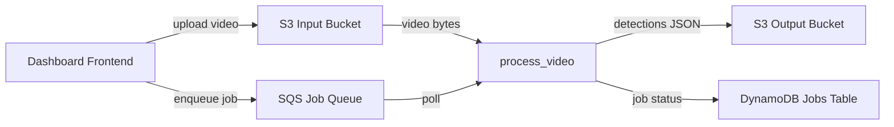

# Codebase Overview

> Distributed batch inference pipeline that processes video files through YOLOv8 object detection and produces per-frame JSON results, designed to run on swappable compute backends (EC2, Fargate, Lambda).

**Last updated:** 2026-07-10  
**Primary language:** Python 3.11+  
**Architecture style:** Worker module within a planned monorepo (worker/ + dashboard/ + terraform/ + docs/)

---

## Architecture overview

The system is a video inference pipeline with a single core function — `process_video()` — that reads video from storage, runs YOLOv8 detection on sampled frames, and writes JSON results back to storage. This function is compute-agnostic: it will be invoked by different wrappers depending on the deployment target (SQS poller on EC2, ECS task on Fargate, or Lambda handler).

Currently only the worker module exists (Phase 1 complete). Phase 2 delivers the AWS infrastructure via Terraform — S3 buckets (input/output), SQS job queue with DLQ, DynamoDB jobs table, and least-privilege IAM roles for worker and frontend. The full system will add a React dashboard (Phase 3) and three compute invokers (Phases 4-6).



State is stored externally: video files in S3, results as JSON in S3, job metadata in DynamoDB. The worker itself is stateless — all state flows through the storage adapter and schemas. The Terraform state is stored locally (`terraform/terraform.tfstate`), not in S3.

---

## Tech stack

| Layer | Technology | Notes |
|---|---|---|
| Runtime | Python 3.11+ | Requires `>=3.11` per pyproject.toml; uses 3.13 locally |
| Data validation | Pydantic v2 | `field_validator` decorators; `model_dump(mode="json")` for serialization |
| ML inference | ultralytics (YOLOv8) | CPU-only (free tier); `yolov8n.pt` default weights |
| Video processing | OpenCV (cv2) | Decodes video via temp file on Windows (cannot read raw bytes) |
| Numerical | NumPy | Frames are `(H, W, 3)` uint8 arrays |
| Build | Hatchling | PEP 517 build backend |
| Cloud SDK | boto3 | S3 operations (not yet wired — storage adapter uses local fallback) |
| Cloud provider | AWS | S3, SQS, DynamoDB, IAM |
| IaC | Terraform >= 1.0 | AWS provider ~> 5.0; native `.tftest.hcl` test files |
| Testing (Python) | pytest + pytest-cov + pytest-mock | 78 unit tests across 4 files; `addopts = "-v --tb=short"` |
| Testing (Terraform) | `terraform test` (native) | 29 tests across 6 `.tftest.hcl` files using `mock_provider` |

---

## Entry points

| Entry | Command | Purpose |
|---|---|---|
| Worker pipeline | `worker.src.processor.process_video(job)` | Core inference function; takes `JobInput`, returns `JobResult` |
| YOLO detection | `worker.src.detector.predict(frame)` | Runs YOLOv8 on a single numpy frame; auto-loads model on first call |
| Storage I/O | `worker.src.storage.read_video()` / `write_json()` | Local file mode (default); S3 mode stubbed |
| Terraform plan | `terraform plan -var-file=env/dev.tfvars` | Plan infrastructure changes |
| Terraform apply | `terraform apply -var-file=env/dev.tfvars` | Deploy infrastructure |
| Terraform test | `terraform test` (from `terraform/`) | Run all native `.tftest.hcl` tests |

---

## Key modules

| Path | Responsibility |
|---|---|
| `worker/src/schemas.py` | Pydantic models: `Detection`, `JobInput`, `JobResult`. Source of truth for all data contracts. Bbox uses YOLO format `[x_center, y_center, width, height]` normalized 0-1. |
| `worker/src/detector.py` | YOLOv8 wrapper. `load_model()` returns a model object; `predict()` accepts a numpy frame and returns `List[Detection]`. Uses a global singleton `_model` pattern. |
| `worker/src/processor.py` | `process_video()` orchestrator. Reads video bytes → decodes frames via OpenCV → runs detection per frame → writes JSON results. Handles all error paths and returns `JobResult`. |
| `worker/src/storage.py` | `StorageAdapter` class with `read_video()` and `write_json()`. Local file mode (default); S3 mode stubbed with `NotImplementedError`. Module-level functions wrap a global adapter instance. |
| `terraform/main.tf` | Root module — wires 5 child modules together (S3 input, S3 output, SQS, DynamoDB, IAM). Passes ARNs between modules for IAM policy scoping. |
| `terraform/modules/s3-input/` | S3 input bucket with CORS (dashboard origin), versioning, AES256 encryption, public access block. |
| `terraform/modules/s3-output/` | S3 output bucket with versioning, AES256 encryption, public access block. |
| `terraform/modules/sqs/` | SQS job queue (300s visibility timeout, 14-day retention, SQS-managed SSE) + DLQ (maxReceiveCount: 3). |
| `terraform/modules/dynamodb/` | DynamoDB jobs table (`PAY_PER_REQUEST`, TTL, server-side encryption, point-in-time recovery). Hash key: `jobId` (String). |
| `terraform/modules/iam/` | Two IAM roles (worker, frontend) with least-privilege inline policies. No wildcard actions. Worker trusts EC2 service. |
| `tests/unit/` | 4 test files, 78 tests. All marked as LOCKED — do not modify. Cover schemas, detector, storage, and processor. |
| `terraform/tests/` + `terraform/modules/*/tests/` | Native Terraform tests (`.tftest.hcl`). Use `mock_provider` for fast, no-credential testing. 29 tests total. |
| `.agent-tasks/` | Orchestrator-driven planning artifacts: phased plan, agent team roster, per-agent task lists, project status. |

> ⚠️ `worker/src/processor.py` — The `process_video()` function is the central integration point. Changes here affect all compute backends (EC2, Fargate, Lambda). Test with the full unit suite before merging.

> ⚠️ `terraform/modules/iam/main.tf` — IAM policies control what the worker and frontend can access. Changes to policy statements require re-running the security audit (`docs/security/phase2-audit-report.md`).

---

## Terraform module structure

The root `terraform/main.tf` composes five child modules. Each module is self-contained with its own `main.tf`, `terraform.tf`, and `tests/main.tftest.hcl`.

```
terraform/
  main.tf              # Root module — wires child modules, passes ARNs
  variables.tf         # project_name, environment, dashboard_origin
  outputs.tf           # 11 outputs (bucket IDs/ARNs, queue URL/ARN, table name/ARN, role ARNs)
  backend.tf           # Local state backend, AWS provider ~> 5.0
  env/dev.tfvars       # Default dev environment values
  modules/
    s3-input/          # Input bucket: CORS, versioning, encryption, public access block
    s3-output/         # Output bucket: versioning, encryption, public access block
    sqs/               # Job queue + DLQ: redrive policy, SSE, visibility timeout
    dynamodb/          # Jobs table: PAY_PER_REQUEST, TTL, encryption, PITR
    iam/               # Worker + frontend roles with least-privilege inline policies
```

**Resource naming convention:** `${var.project_name}-${var.environment}-<purpose>` (e.g., `ProjectCerberus-dev-input`).

**State backend:** Local file (`terraform/terraform.tfstate`). Not yet configured for S3 remote state.

**Module wiring:** The IAM module receives ARNs from S3, SQS, and DynamoDB modules as input variables. This ensures IAM policies reference the correct resource ARNs without hardcoding.

---

## Test structure

### Python unit tests (Phase 1)

| File | Module covered | Key areas |
|---|---|---|
| `tests/unit/test_schemas.py` | `worker/src/schemas.py` | Pydantic model validation, field constraints, bbox normalization |
| `tests/unit/test_detector.py` | `worker/src/detector.py` | Model loading, predict with mocked model, input validation |
| `tests/unit/test_storage.py` | `worker/src/storage.py` | Local file read/write, error handling, adapter initialization |
| `tests/unit/test_processor.py` | `worker/src/processor.py` | End-to-end process_video with mocked deps, error paths, temp file cleanup |

**78 tests total. All LOCKED** — implementation agents must never modify these files. Tests define the contract; code must conform to them.

Run with: `pytest` (from repo root).

### Terraform native tests (Phase 2)

| File | Module tested | What it asserts |
|---|---|---|
| `terraform/tests/root_module.tftest.hcl` | Root module | Variable defaults, all 11 outputs exist and are valid ARNs, output wiring from child modules |
| `terraform/modules/s3-input/tests/main.tftest.hcl` | s3-input | Bucket naming, CORS config, versioning, encryption, public access block |
| `terraform/modules/s3-output/tests/main.tftest.hcl` | s3-output | Bucket naming, versioning, encryption, public access block |
| `terraform/modules/sqs/tests/main.tftest.hcl` | sqs | Queue naming, visibility timeout, receive wait time, redrive policy, DLQ config, SSE |
| `terraform/modules/dynamodb/tests/main.tftest.hcl` | dynamodb | Table naming, billing mode, TTL, encryption, PITR |
| `terraform/modules/iam/tests/main.tftest.hcl` | iam | Role names, trust policies, least-privilege policy actions, no wildcard actions/resources, correct ARN references, role-policy attachments |

**29 tests total.** All use `mock_provider "aws"` — no real AWS credentials needed. Run with: `terraform test` (from `terraform/` directory).

**Deprecated:** `tests/integration/test_infra.py` contains 26 tests with known regex bugs producing false negatives. Kept in place but not actively run.

---

## Security posture

A security audit was completed on 2026-07-10 (`docs/security/phase2-audit-report.md`). Key findings:

**Passed:**
- IAM policies follow least privilege — no wildcard actions, no admin permissions, no wildcard resource `*`
- Worker role scoped to: S3 GetObject (input), S3 PutObject (output), SQS receive/delete/get-attrs, DynamoDB put/update/get
- Frontend role scoped to: S3 PutObject (input), SQS send, DynamoDB query/get
- Both roles trust only `ec2.amazonaws.com`

**Remediated (in current Terraform):**
- S3 buckets: public access blocks added to both input and output buckets
- S3 output bucket: versioning and server-side encryption (AES256) enabled
- SQS: SQS-managed server-side encryption enabled (`sqs_managed_sse_enabled = true`)
- DynamoDB: server-side encryption and point-in-time recovery enabled

**Known gaps (documented, not yet applied):**
- IAM condition keys for IP/VPC restrictions (long-term improvement)
- Bucket policies for object-level access control (optional enhancement)
- Regular security audit automation

Review the full audit report at `docs/security/phase2-audit-report.md` and the IAM-specific audit at `docs/security/phase2-iam-audit.md`.

---

## Non-obvious patterns

**Locked tests as executable specification**  
All unit test files in `tests/unit/` are marked LOCKED and must never be modified by implementation agents. Tests were written first (TDD Red phase) and define the exact contract for each module. If a test fails after your change, the implementation is wrong — not the test.

**OpenCV requires temp file for video decoding on Windows**  
`processor.py` writes video bytes to a `NamedTemporaryFile` before passing the path to `cv2.VideoCapture`. OpenCV on Windows cannot read raw bytes directly via `VideoCapture` — it needs a file path. The temp file is cleaned up in a `finally` block.

**Global model singleton in detector.py**  
`detector.py` uses a module-level `_model` variable. `load_model()` sets it; `predict()` calls it lazily if not yet loaded. This avoids re-loading the model on every frame but means the model persists for the process lifetime. In production, each compute invocation (Lambda, Fargate task) gets a fresh process, so this is safe.

**Storage adapter is swappable but not yet wired to S3**  
`StorageAdapter` accepts `use_s3=True` but both S3 methods raise `NotImplementedError`. Local file mode uses `data/` as the base path. The module exposes `read_video()` and `write_json()` as free functions wrapping a global adapter instance — this is the interface `processor.py` calls.

**Detection bbox format: YOLO, not COCO**  
Bounding boxes are `[x_center, y_center, width, height]` normalized to 0-1. This is the standard YOLO output format, not the COCO `[x, y, width, height]` absolute format. The `Detection` model validates each component is in `(0, 1]` range.

**Terraform tests use mock_provider, not real AWS**  
All `.tftest.hcl` files use `mock_provider "aws"` with hardcoded mock ARNs. This means tests run instantly without credentials. If you add new resources, you must also add mock defaults or the test will fail during `apply`-command run blocks.

**Terraform state is local, not remote**  
State is stored in `terraform/terraform.tfstate` (gitignored). This works for a solo developer but will cause conflicts with multiple contributors. Migrate to S3 backend before team use.

**Error results are written to storage**  
When `process_video()` fails, it attempts to write a `results/{job_id}_error.json` file before returning a failed `JobResult`. If the error write also fails, it is silently swallowed — the caller still gets the failed result.

**IAM module receives ARNs as input variables**  
The IAM module does not reference other modules directly. ARNs are passed as variables from the root module, keeping the IAM module reusable and testable in isolation.

---

## Development workflow

### Python worker

```bash
# 1. Create virtual environment and install dependencies
python -m venv .venv
.venv\Scripts\activate          # Windows
pip install -e ".[dev]"

# 2. Run the full test suite (78 tests, all should pass)
pytest

# 3. Run tests with coverage
pytest --cov=worker --cov-report=term-missing

# 4. Run a specific test file or function
pytest tests/unit/test_schemas.py -v
pytest tests/unit/test_detector.py::TestLoadModel -v
```

### Terraform infrastructure

```bash
# 1. Initialize Terraform (downloads AWS provider)
cd terraform
terraform init

# 2. Run native tests (no AWS credentials needed)
terraform test

# 3. Plan infrastructure changes
terraform plan -var-file=env/dev.tfvars

# 4. Apply infrastructure (requires AWS credentials)
terraform apply -var-file=env/dev.tfvars

# 5. Destroy infrastructure
terraform destroy -var-file=env/dev.tfvars
```

**Environment variables:** AWS credentials must be configured (`aws configure` or environment variables). The Terraform modules use the default AWS provider configuration.

**Test markers** (defined in pyproject.toml but not yet applied to tests):
- `unit` — fast, no external dependencies (current tests)
- `integration` — require real AWS resources
- `e2e` — full pipeline

---

## Architecture decisions

**Single `process_video()` function as the compute-agnostic core**  
The entire inference pipeline is a single function that takes a `JobInput` and returns a `JobResult`. Compute invokers (EC2 poller, Fargate task, Lambda handler) are thin wrappers that parse events, call this function, and handle side effects (SQS delete, DynamoDB update). This makes swapping compute backends a matter of writing a new invoker — not changing pipeline logic.

**TDD with locked tests before implementation**  
The tester agent writes all unit tests for a phase first, confirms they fail (Red), then implementation agents write code to make them pass (Green). Tests are never modified by implementation agents. This is enforced by the orchestrator.

**Versioned compute progression: EC2 → Fargate → Lambda**  
The same `process_video()` function runs on all three compute backends. Each version teaches a different AWS deployment model. The worker code does not change between versions — only the invoker and infrastructure change.

**Pydantic models as the data contract**  
`Detection`, `JobInput`, and `JobResult` are the single source of truth for all data flowing through the system. The processor builds results using `JobResult.model_dump(mode="json")` to ensure consistent field names and ISO timestamps. The detections field is overridden post-dump to use the `(frame_index, detections[])` tuple format.

**JSON-only output (no annotated video)**  
Results are stored as structured JSON, not rendered video with bounding box overlays. This avoids an FFmpeg dependency and keeps the pipeline lightweight for free-tier constraints.

**Terraform modules are flat, not nested**  
Each AWS service gets its own module under `terraform/modules/`. There is no nesting of modules within modules. The root module wires them together and passes ARNs. This keeps the dependency graph simple and tests isolated.

---

## Before you change code

- The 4 test files in `tests/unit/` are LOCKED. Never modify them. If your change breaks a test, fix the implementation.
- `processor.py` uses `cv2.VideoCapture` with a temp file path — not raw bytes. If you change how video is read, verify on Windows where OpenCV file-path behavior differs from Linux.
- `detector.py` uses a global `_model` singleton. In multi-threaded contexts this could cause race conditions. Current compute models are single-threaded per invocation, but watch this if concurrency is added.
- `storage.py` S3 methods raise `NotImplementedError`. When implementing S3 support, keep the local file fallback working — tests depend on it.
- `JobResult.detections` is `list[tuple[int, list[Detection]]]` — a list of `(frame_index, detections)` tuples, not a flat list. The processor manually constructs this format after `model_dump()`.
- The `data/` directory is the local storage root. It is created automatically by `StorageAdapter.__init__()` but is not gitignored — result files may accumulate.
- When modifying Terraform modules, run `terraform test` before committing. Tests use `mock_provider` and do not require AWS credentials.
- IAM policy changes require re-running the security audit. Document findings in `docs/security/`.
- `.agent-tasks/` contains orchestrator planning artifacts. These are not part of the application but document the build plan and agent assignments. Read `PLAN.md` in `.agent-tasks/architect/` for the full phased roadmap.
