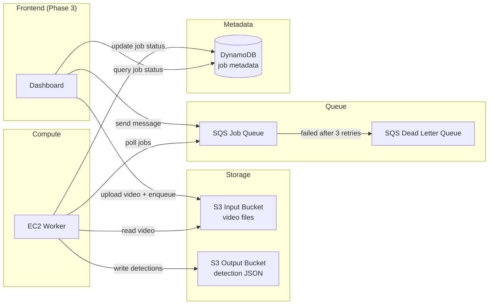

# Project Cerberus

**Distributed Batch Inference Pipeline for YOLOv8 Video Detection**

[](https://www.python.org/downloads/)
[](https://www.terraform.io/)
[](LICENSE)
[](#testing)

---

## Description

Project Cerberus is a distributed batch inference pipeline that processes video files through YOLOv8 object detection and produces structured JSON results. The system is designed with swappable compute backends (EC2, Fargate, Lambda) and follows a phased build-out from core worker logic to full cloud deployment.

**Current status:** Phase 1 (core worker logic) and Phase 2 (AWS infrastructure) are complete with 110 passing tests (78 Python unit tests + 32 Terraform infrastructure tests). Phase 3 (dashboard and API) is not yet started.

### What it does

1. Accepts video files via an S3 input bucket
2. Queues processing jobs through SQS
3. EC2 workers pull jobs, run YOLOv8 detection on sampled frames, and write per-frame JSON results to an S3 output bucket
4. Job metadata is tracked in DynamoDB
5. A dashboard (Phase 3) will provide monitoring and job management

---

## Architecture



### Pipeline flow

```
Video Upload --> S3 Input --> SQS Queue --> EC2 Worker --> YOLOv8 Detection
                                                      |-> S3 Output (JSON results)
                                                      |-> DynamoDB (job metadata)
```

---

## Prerequisites

| Tool | Version | Purpose |
|---|---|---|
| Python | 3.11+ | Worker runtime (tested on 3.13) |
| Terraform | >= 1.0 | AWS infrastructure provisioning |
| AWS CLI | v2 | Authentication and resource management |
| uv or pip | latest | Python dependency management |

**AWS account** with appropriate permissions for S3, SQS, DynamoDB, IAM, and EC2 in `us-east-1`.

---

## Project Structure

```
ProjectCerberus/
├── worker/                     # Core inference worker
│   └── src/
│       ├── schemas.py          # Pydantic models (Detection, JobInput, JobResult)
│       ├── detector.py         # YOLOv8 wrapper (load_model, predict)
│       ├── processor.py        # process_video() orchestrator
│       └── storage.py          # Storage adapter (local file mode)
├── tests/
│   ├── unit/                   # 78 unit tests (pytest)
│   └── integration/            # Integration tests (require AWS resources)
├── terraform/                  # AWS infrastructure as code
│   ├── main.tf                 # Root module composition
│   ├── variables.tf            # Input variables
│   ├── outputs.tf              # Output values
│   ├── backend.tf              # State backend configuration
│   ├── env/dev.tfvars          # Development environment variables
│   ├── tests/                  # Native Terraform tests (.tftest.hcl)
│   └── modules/
│       ├── s3-input/           # S3 input bucket with CORS, encryption, versioning
│       ├── s3-output/          # S3 output bucket with encryption, versioning
│       ├── sqs/                # SQS job queue with DLQ and redrive policy
│       ├── dynamodb/           # DynamoDB jobs table with TTL and PITR
│       └── iam/                # IAM roles and least-privilege policies
├── data/                       # Local storage root (gitignored)
├── docs/                       # Documentation and audit reports
│   └── security/               # Security audit reports
├── .agent-tasks/               # Orchestrator planning artifacts
├── pyproject.toml              # Python project metadata and dependencies
└── README.md                   # This file
```

---

## Setup

### Local Development (Python Worker)

```bash
# Clone the repository
git clone https://github.com/your-org/ProjectCerberus.git
cd ProjectCerberus

# Create and activate virtual environment
python -m venv .venv
# Windows:
.venv\Scripts\activate
# macOS/Linux:
source .venv/bin/activate

# Install dependencies (editable mode with dev extras)
pip install -e ".[dev]"
```

No environment variables are required for local development. The storage adapter defaults to local file mode using `data/` as the base path.

### Deploying Infrastructure (Terraform)

```bash
cd terraform

# Initialize Terraform providers
terraform init

# Review the execution plan
terraform plan -var-file="env/dev.tfvars"

# Apply infrastructure (requires confirmation)
terraform apply -var-file="env/dev.tfvars"
```

**Deployed resources** (us-east-1):

| Resource | Name Pattern |
|---|---|
| S3 Input Bucket | `projectcerberus-dev-input` |
| S3 Output Bucket | `projectcerberus-dev-output` |
| SQS Job Queue | `projectcerberus-dev-jobs` |
| SQS Dead Letter Queue | `projectcerberus-dev-dlq` |
| DynamoDB Jobs Table | `projectcerberus-dev-jobs` |
| IAM Worker Role | `projectcerberus-dev-worker-role` |
| IAM Frontend Role | `projectcerberus-dev-frontend-role` |

Outputs (bucket IDs, queue URL, table name, role ARNs) are printed after a successful apply.

---

## Testing

### Python Unit Tests

The unit test suite covers schemas, detector, storage, and processor modules. All 78 tests are marked as **LOCKED** -- they define the implementation contract and must not be modified.

```bash
# Run all unit tests
pytest tests/unit/

# Run with verbose output
pytest tests/unit/ -v

# Run a specific test file
pytest tests/unit/test_schemas.py -v

# Run a specific test class
pytest tests/unit/test_detector.py::TestLoadModel -v

# Run with coverage report
pytest tests/unit/ --cov=worker --cov-report=term-missing
```

**Test markers** (defined in `pyproject.toml`):

| Marker | Description |
|---|---|
| `unit` | Fast, no external dependencies (current tests) |
| `integration` | Require real AWS resources |
| `e2e` | Full pipeline end-to-end |

### Terraform Infrastructure Tests

Native Terraform tests (`.tftest.hcl`) validate infrastructure configuration using mock providers -- no real AWS resources are created.

```bash
cd terraform

# Run all Terraform tests
terraform test

# Run tests for a specific module
terraform test terraform/modules/sqs/tests/
```

The test suite covers variable defaults, output wiring, and resource configuration across all modules. See `terraform/tests/root_module.tftest.hcl` for root-level integration tests.

---

## Security

The infrastructure follows AWS security best practices, validated through a formal security audit.

### IAM Least-Privilege

- **Worker Role**: `s3:GetObject` (input bucket), `s3:PutObject` (output bucket), `sqs:ReceiveMessage/DeleteMessage/GetQueueAttributes`, `dynamodb:PutItem/UpdateItem/GetItem`
- **Frontend Role**: `s3:PutObject` (input bucket), `sqs:SendMessage`, `dynamodb:Query/GetItem`
- No wildcard actions on any role
- Resource-scoped policies with `/*` patterns for S3 object-level operations

### Encryption and Access Control

- **S3**: Server-side encryption (AES256) enabled on both buckets; public access blocked on all buckets
- **SQS**: Server-side encryption enabled; dead-letter queue with maxReceiveCount of 3
- **DynamoDB**: Server-side encryption enabled; point-in-time recovery enabled; TTL for automatic cleanup
- **S3 Input Bucket**: CORS restricted to dashboard origin; versioning enabled

### Audit Reports

Detailed audit reports are available in `docs/security/`:

- `phase2-iam-audit.md` -- IAM policy compliance review
- `phase2-audit-report.md` -- Full infrastructure security audit

---

## Teardown

Remove all AWS resources to avoid ongoing charges:

```bash
cd terraform

# Preview what will be destroyed
terraform plan -destroy -var-file="env/dev.tfvars"

# Destroy all resources (requires confirmation)
terraform destroy -var-file="env/dev.tfvars"
```

This deletes the S3 buckets (and their contents), SQS queues, DynamoDB table, and IAM roles/policies created for the `dev` environment.

---

## Roadmap

| Phase | Description | Status |
|---|---|---|
| Phase 0 | Environment setup | Complete |
| Phase 1 | Core worker logic (Python) with 78 unit tests | Complete |
| Phase 2 | AWS infrastructure (Terraform) with 32 native tests | Complete |
| Phase 3 | Dashboard + API Lambda | Not started |
| Phase 4 | EC2 worker deployment and job polling | Not started |
| Phase 5 | Fargate compute backend + CI/CD | Not started |
| Phase 6 | Lambda compute backend + CI/CD v3 | Not started |
| Phase 7 | Documentation finalization | Not started |

**Next up:** Phase 3 will add a React dashboard for job monitoring and an API Lambda for job submission.

---

## License

This project is licensed under the MIT License. See [LICENSE](LICENSE) for details.
